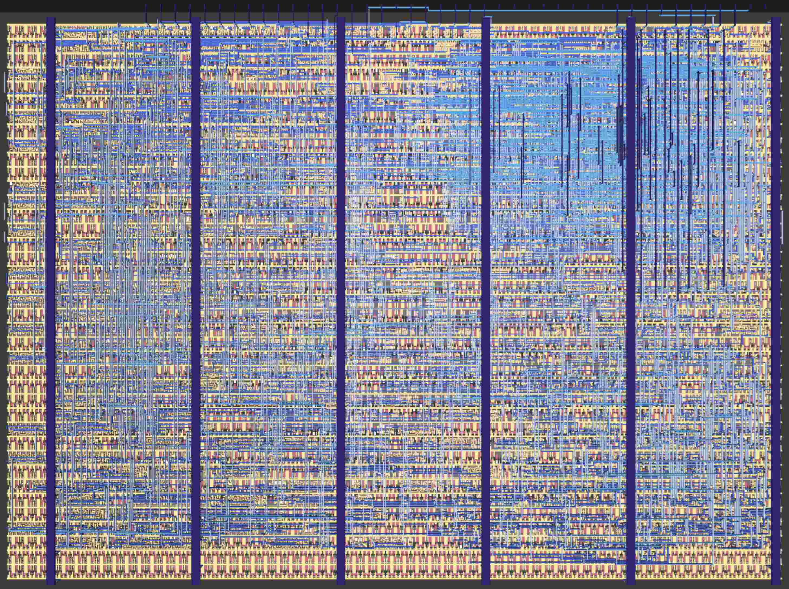

   

# DJ8 8-bit CPU for IHP sg13g2 PDK

- [Read the documentation for project](docs/info.md)

## What is Tiny Tapeout?

TinyTapeout is an educational project that aims to make it easier and cheaper than ever to get your digital designs manufactured on a real chip.

To learn more and get started, visit https://tinytapeout.com